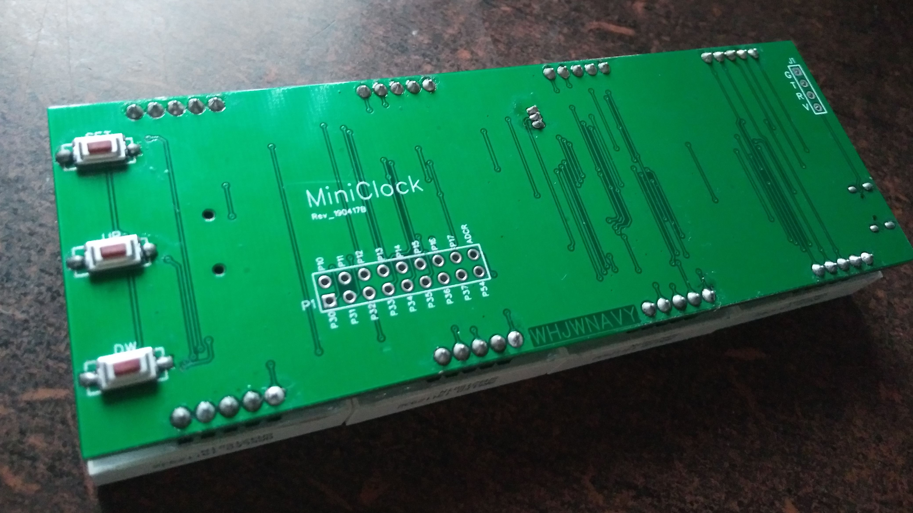
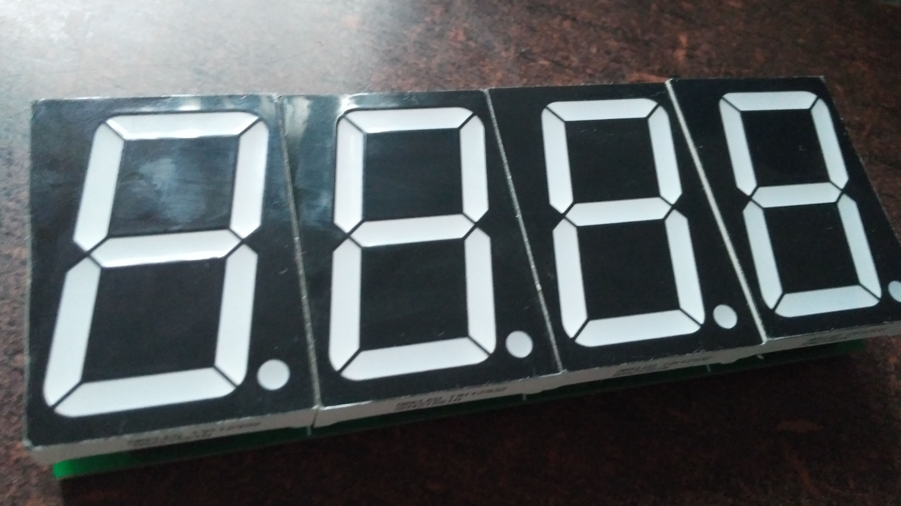
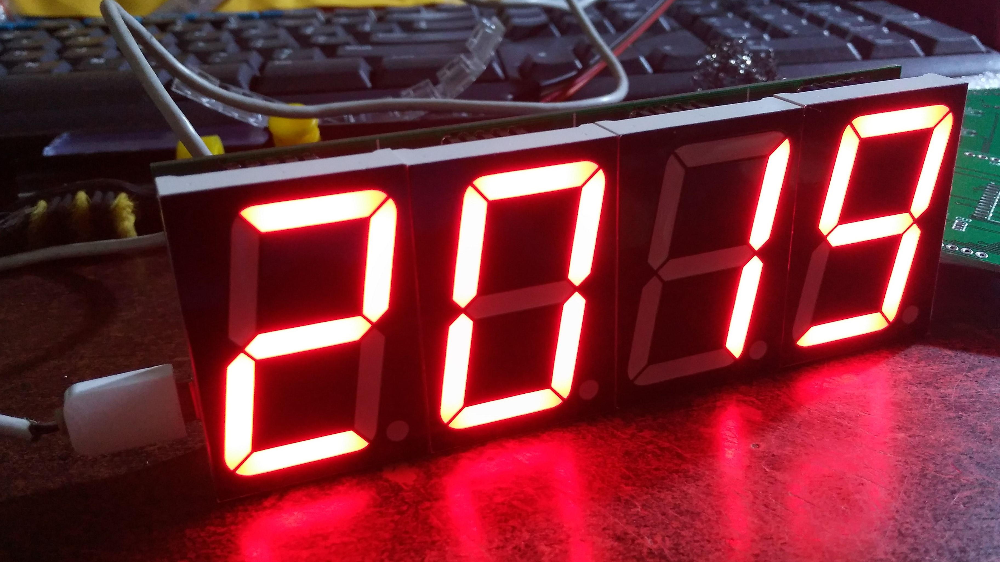
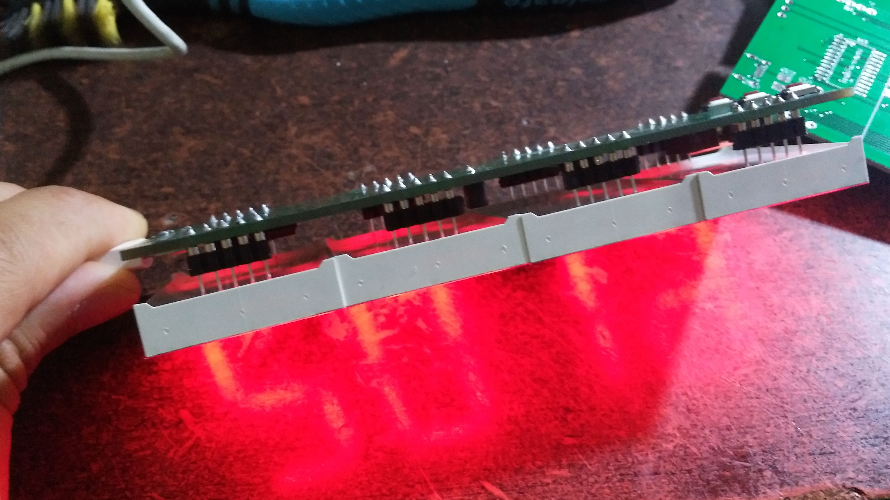
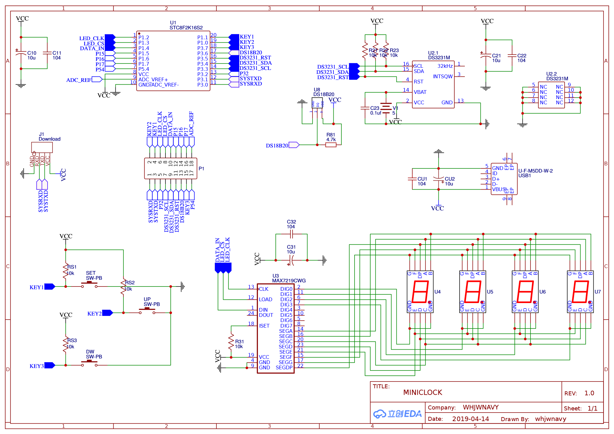
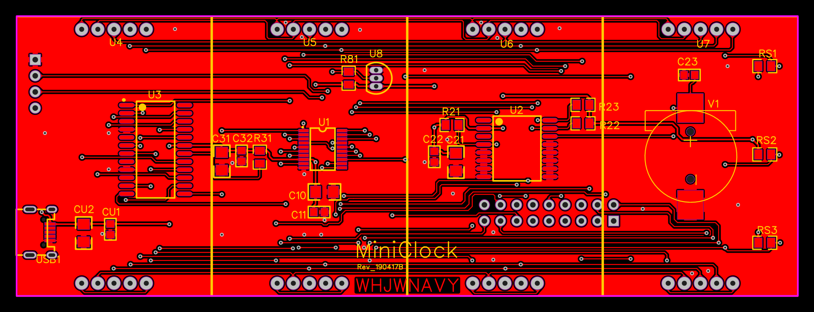

# MIniClock

## 美图欣赏

## 实物图

## 原理图&PCB

* ***[MiniClock_SCH_01_190419B.pdf](./doc/MiniClock_SCH_01_190419B.pdf)***

* ***[Gerber_MINICLOCK_PCB_02_20190419231404.zip](./doc/MiniClock_PCB_Rev190417B/Gerber_MINICLOCK_PCB_02_20190419231404.zip)***

* ***[LCEDA OpenHW PCB & SCH](https://lceda.cn/whjwnavy/led-miniclock)***

## 页面逻辑

## 设置代码

# 使用说明

## 查看

### 查看时间,日历

* 开机后默认显示 **[小时-分钟]** , 底部四个点循环滚动代表秒
* 短按 **Set** 键可以查看 **[秒]**
* 再次短按 **Set** 键可以查看 **[年]**
* 再次短按 **Set** 键可以查看 **[月-日]**
* 再次短按 **Set** 键可以查看 **[星期]** , 1代表周一, 7代表周日
* 15秒内无操作自动回到 **[小时-分钟]** 显示界面

> ***小提示1***
>
> 实际上在 **[小时-分钟]** 显示界面下, 连续短按 **Set** 键, 会依次在 **[小时-分钟] - [秒] - [年] - [月-日] - [星期]** 间循环切换

### 查看温度,农历

* 在 **[小时-分钟]** 显示模式下, 短按 **Up** 键可以查看 **[温度]**
* 再次短按 **Up** 键, 可以查看 **[农历月-日]**
* 在时间显示模式下, 短按 **Dwn** 键可以查看 **[农历月-日]**
* 再次短按 **Dwn** 键, 可以查看 **[温度]**
* 15秒内无操作自动回到 **[小时-分钟]** 显示界面

> ***小提示2***:
>
> 长按(***1秒以上***)一次 **Up** 键可以固定显示温度, 15秒无操作不会退回时间显示界面, 再次短按 **Up*** 或 ***Down** 键可以取消固定

> ***小提示3***
>
> 长按(***1秒以上***)一次 **Dwn** 键可以固定显示农历, 15秒无操作不会退回时间显示界面, 再次短按 **Up*** 或 ***Down** 键可以取消固定

> ***小提示4***
>
> 实际上在 **[小时-分钟]** 显示界面下,连续短按 **Up** 键或 **Dwn** 键, 会依次在 **[小时-分钟] - [温度] - [农历月-日]** 间循环切换

### 待机/休眠模式

* 在 **[小时-分钟]** 显示模式下, 长按(***8秒以上***) **Set** 键可以待机/休眠
* 按任意键结束待机/休眠

## 设置
* 在时间或温度显示界面下, 长按(***1秒以上***) **Set** 键进入 **[设置界面]**
* 设置模式下, 前两位表示 **[设置代码]** ,后两位表示 **[设置值]**
* 设置代码第一位表示 **[主设置项]** , 第二位表示 **[次设置项]**
* 长按(***1秒以上***) **Set** 键切换 **[主设置项]**
* 短按 **Set** 键切换 **[次设置项]**
* 长按(***1秒以上***) **Up** 键保存调整之后的值
* 15秒内无操作自动回到 **[小时-分钟]** 显示界面

> ***小提示5***
>
> 设置值发生改变后会闪烁
>
> 切换主设置项后, 不会自动保存之前的更改
>
> 在 **[系统设置P]** 模式下, 再次长按(***1秒以上***) **Set** 键会回到 **[小时-分钟]** 显示界面

> ***小提示6***
>
> 模式自动休眠开始时间为22:30，结束时间为7:30，MiniClock会在22:30关闭显示界面，直到7:30
>
> MiniClock会在到达你设置的开始时间时关闭显示界面，在到达你设置的结束时间时开启显示界面

> ***小提示7***
>
> 默认的显示模式为正常模式[***0***]，开启旋转显示模式[***1***]后，屏幕内容会旋转180°显示

### 设置代码表

| 主设置项 | 设置代码 |        设置内容        |           值范围            |
| :------: | :------: | :--------------------: | :-------------------------: |
|   时间   |    C1    |        小时设置        |          0   - 23           |
|          |    C2    |        分钟设置        |          0   - 59           |
|          |    C3    |         秒设置         |          0   - 59           |
|   日期   |    H1    |         年设置         |          0   - 99           |
|          |    H2    |         周设置         |     1[周一]   - 7[周日]     |
|          |    H3    |         月设置         |          1   - 12           |
|          |    H4    |         日设置         |          1   - 31           |
|   休眠   |    A1    | 休眠开始时间[小时]设置 |          0   - 23           |
|          |    A2    | 休眠开始时间[分钟]设置 |          0   - 59           |
|          |    A3    | 休眠结束时间[小时]设置 |          0   - 23           |
|          |    A4    | 休眠结束时间[分钟]设置 |          0   - 59           |
|          |    A5    |    休眠开启关闭设置    |     0[关闭]   - 1[开启]     |
|   系统   |    P1    |        亮度设置        |          1   - 12           |
|          |    P2    |      屏幕镜像设置      | 0[正常显示]   - 1[镜像显示] |
